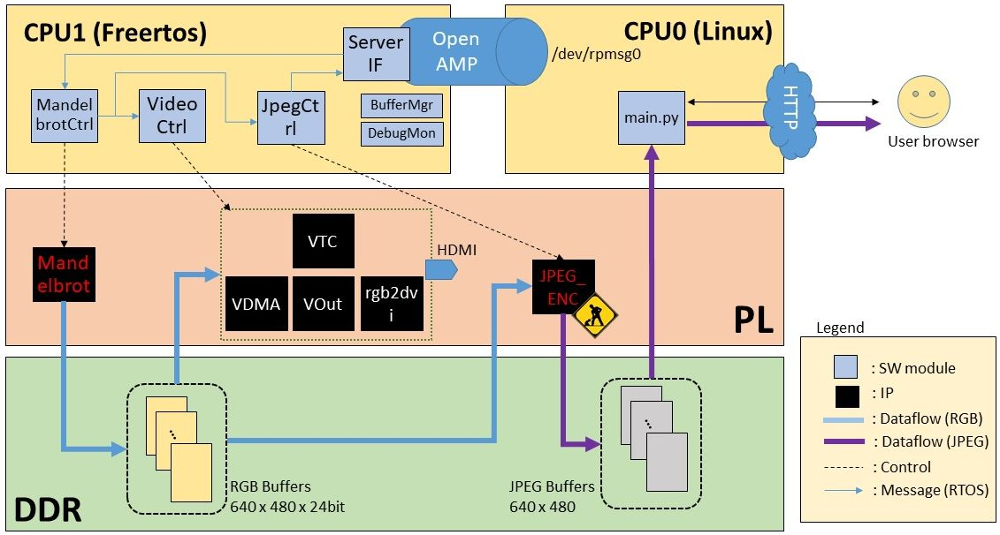

# Portable Mandelbrot with ZYBO (Zynq)


- The Mandelbrot set is calculated by FPGA (Zynq PL)
- Web browser (e.g. smart phone) for controller and viewer

## Development Environment
- Target Board: ZYBO (Z7-20)
- Host PC: Windows 10 64-bit
	- Vivado 2017.4 WebPACK (for HW design)
	- Vivado HLS 2017.4 (for HW IP design)
	- Xilinx SDK 2017.4 (for C application development)
	- Visual Studio Code (for Python script development)
- Host PC: Ubuntu 16.04 (on VirtualBox 5.2.4)
	- PetaLinux 2017.4 (for Linux/Boot image making)

## Technical overview


- Programmable Logic (PL)
	- Mandelbrot
		- created by Vivado HLS
		- generate the Mandelbrot set as RGB image and write the image to DDR
	- HDMI modules
		- output the RGB Mandelbrot image to HDMI
	- JPEG_ENC
		- T.B.D. I use software jpeg encoder instead
- Baremetal Firmware (CPU1)
	- Running on FreeRTOS
	- Each XXXCtrl module controls hardware
	- ServerIF communicates with the server on CPU0 using OpenAMP technology
		- receives commands from the server, then send the internal command to each XXXCtrl module
		- sends the latest JPEG image address to the server
- Server script (CPU0)
	- Python script with bottle.py framework
		- provides Web APIs
		- communicates with the baremetal firmware via /dev/rpmsg0 (OpenAMP)
	- index.html and JavaScript as user interface (view and controller)

# How to run with the pre-built binary
1. Copy the following files into the SD card (FAT32)
	- PjPetaLinuxMandelbrot/pre-built/linux/images/BOOT.BIN
	- PjPetaLinuxMandelbrot/pre-built/linux/images/image.ub
2. Start ZYBO (JP5 is set to SD)
	- Baremetal application (CPU0) and server (python script on CPU1) will start automatically
	- if HDMI display is connected, the Mandelbrot set will be displayed
3. Check the terminal log to find IP address (e.g. 192.168.1.87)
4. Connect to the server from any browser in the same network as ZYBO
	- '192.168.1.87:8080'


# The following is memo to modify the project

# How to modify and debug the project
## Preparation
When you debug, you need to stop auto-started application by disabling init.d daemon or stopping application manually.

- Delete or comment out all the lines of the following script
	- `PjPetaLinuxMandelbrot/project-spec/meta-user/recipes-apps/AppMandelbrot/files/mandelbrot_init_run.sh`
- Stop auto-started application and OpenAMP manually

	```sh:ZYBO_terminal
	ps aux | grep 'python main.py' | grep -v grep | awk '{ print "kill -9", $1 }' | sh
	ps aux | grep mandelbrot_init | grep -v grep | awk '{ print "kill -9", $1 }' | sh
	echo stop > /sys/class/remoteproc/remoteproc0/state
	```

Then, you can modify the project. The way to modification varies depends on what you want to edit.

## Linux Image (PetaLinux)
### How to edit the server application (PetaLinux)
The server application consists of python scripts, html files and JavaScript. These files are located in `PjPetaLinuxMandelbrot/project-spec/meta-user/recipes-apps/AppMandelbrot/files/MandelbrotServer/`

1. Edit files in host PC
2. Copy the files from host PC to ZYBO
	- It is convenient to use VSCode and SFTP plugin
3. Start OpenAMP and the server

	```sh:ZYBO_terminal
	modprobe rpmsg_user_dev_driver
	echo fw_bm_mandelbrot.elf > /sys/class/remoteproc/remoteproc0/firmware
	echo start > /sys/class/remoteproc/remoteproc0/state
	python main.py
	```

4. To re-run the server,

	```sh:ZYBO_terminal
	Ctrl-C to stop python
	echo stop > /sys/class/remoteproc/remoteproc0/state
	Re-upload files
	echo start > /sys/class/remoteproc/remoteproc0/state
	```

### How to edit init.d script
- Modify the following files
	- PjPetaLinuxMandelbrot/project-spec/meta-user/recipes-apps/AppMandelbrot/files/mandelbrotinit
	- PjPetaLinuxMandelbrot/project-spec/meta-user/recipes-apps/AppMandelbrot/files/mandelbrot_init_run.sh
	- PjPetaLinuxMandelbrot/project-spec/meta-user/recipes-apps/AppMandelbrot/AppMandelbrot.bb 

### How to update baremetal firmware
After creating the new baremetal firmware (described later), you may want to install it to Linux image.
Replace the following file

- PjPetaLinuxMandelbrot/project-spec/meta-user/recipes-apps/AppMandelbrot/files/fw_bm_mandelbrot.elf

### How to modify device tree
```sh:PetaLinux
code PjPetaLinuxMandelbrot/project-spec/meta-user/recipes-bsp/device-tree/files/system-user.dtsi &
```

### How to update hardware
After creating the new hardware (hdf) (described later), you may want to create the new Linux image with it.
Copy the new `design_1_wrapper.hdf` to PjPetaLinuxMandelbrot directory in the PetaLinux project.

```sh:PetaLinux
cd PjPetaLinuxMandelbrot
petalinux-config --get-hw-description=.
```

### How to modify config
if you want.

```sh:PetaLinux
petalinux-config -c kernel
petalinux-config -c rootfs
```

### How to create Linux image
After any of the above modification, you need to build.

```sh:PetaLinux
petalinux-build
petalinux-package --boot --force --fsbl images/linux/zynq_fsbl.elf --fpga images/linux/design_1_wrapper.bit --u-boot
```

## Baremetal Firmware (Xilinx SDK)
### How to generate baremetal firmware
1. Open the workspace
	- launch from Vivado (Launch SDK)
	- or, start XSDK and switch workspace to `project_1\project_1.sdk`
		- File -> Switch Workspace -> other
2. Import projects (if there is no project)
	- right click in Project Explorer -> Import
	- General -> Existing Projects into Workspace
3. Re-generate BSP (if compile error occurs)
	- Right click on fw_bm_mandelbrot_bsp
	- Re-generate bsp source
4. edit source code
5. build the project, then fw_bm_mandelbrot.elf is generated

### How to run the generated baremetal firmware
1. Start Linux with the pre-build binary(BOOT.BIN and image.ub)
	- stop or disable the auto-started application (see Preparation)
2. Upload the new elf file
	- open a terminal in the same folder as fw_bm_mandelbrot.elf
	- `scp  -o StrictHostKeyChecking=no -o UserKnownHostsFile=/dev/null *.elf root@192.168.1.87:/lib/firmware/.`
5. re-run the application
	- `modprobe rpmsg_user_dev_driver`
	- `echo fw_bm_mandelbrot.elf > /sys/class/remoteproc/remoteproc0/firmware`
	- `echo start > /sys/class/remoteproc/remoteproc0/state`
	- `cd www/MandelbrotServer ; python main.py`

### How to run as standalone firmware
It might be userful if you can run the baremetal firmware as standalone, especially for debugging related to hardware.

- Right click on fw_bm_mandelbrot_bsp -> BSP Settings
	- delete ` -DUSE_AMP=1` from extra_compiler_flags
- `fw_bm_mandelbrot\src\Utility\parameters.h`
	- enable `#define STANDALONE`
- Build the project
- Boot Zybo (JP5 is JTAG)
- Program FPGA, then Run/Debug as Launch on Hardware (System Debugger)

## Hardware (Vivado)
Open the Vivado project (`project_1\project_1.xpr`). After modification and generating bitstream, export hardware (hdf)

## Hardware IP (Vivado HSL)
Open the Vivado HLS project (`project_1\HLS\Mandelbrot`). After C synthesis and exporting RTL, update IP in Vivado.

# (Memo) How to start the project from scratch
1. Create Hardware in Vivado and Vivado HLS
2. Create baremetal firmware as standalone (CPU1, C, FreeRTOS)
	- to debug hardware and implement basic functions
3. Crete Linux image with OpenAMP
	- install OpenAMP and modify device tree

	```sh:PetaLinux
	petalinux-create --type project --template zynq --name PjPetaLinuxMandelbrot
	cd PjPetaLinuxMandelbrot
	petalinux-config --get-hw-description=.
	petalinux-config -c kernel	# no need to modify
	petalinux-config -c rootfs	# Install openamp
	code project-spec/meta-user/recipes-bsp/device-tree/files/system-user.dtsi &
	petalinux-build
	petalinux-package --boot --force --fsbl images/linux/zynq_fsbl.elf --fpga images/linux/design_1_wrapper.bit --u-boot
	```

4. Change the baremetal firmware to OpenAMP slave
	- Add OpenAmp and libmetal to BSP. Add ` -DUSE_AMP=1`. Modify Linker Script. Others (see `project_1.sdk\fw_bm_mandelbrot\src\ServerIF`).
5. Create server script as OpenAMP master
	- `PjPetaLinuxMandelbrot\project-spec\meta-user\recipes-apps\AppMandelbrot\files\MandelbrotServer`
6. Debug OpenAMP stuffs
	- Upload the baremetal firmware
		- `scp  -o StrictHostKeyChecking=no -o UserKnownHostsFile=/dev/null *.elf root@192.168.1.87:/lib/firmware/.`
	- Upload the server script (I use VSCode and SFTP plugin)
	- Run the applications
	
	```sh:ZYBO_termnal
	modprobe rpmsg_user_dev_driver
	echo fw_bm_mandelbrot.elf > /sys/class/remoteproc/remoteproc0/firmware
	echo start > /sys/class/remoteproc/remoteproc0/state
	python main.py
	```

7. Install the applications and init.d daemon script (PetaLinux)

	```sh:PetaLinux
	petalinux-create -t apps --template install -n AppMandelbrot --enable
	cp ~/work/peta/fw_bm_mandelbrot.elf PjPetaLinuxMandelbrot/project-spec/meta-user/recipes-apps/MyRemoteAppEchoTest/files/.
	cp -r ~/work/peta/MandelbrotServer PjPetaLinuxMandelbrot/project-spec/meta-user/recipes-apps/MyRemoteAppEchoTest/files/.
	code project-spec/meta-user/recipes-apps/AppMandelbrot/AppMandelbrot.bb &
	petalinux-build
	petalinux-package --boot --force --fsbl images/linux/zynq_fsbl.elf --fpga images/linux/design_1_wrapper.bit --u-boot
	```